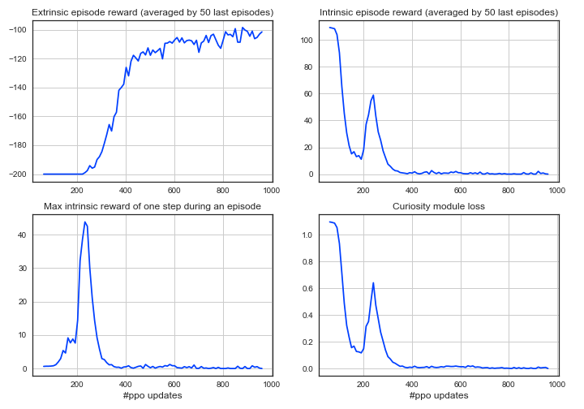

# Comparative study of intrinsic motivations

Here we'll compare the most popular intrinsic motivations on the tasks [__MountainCar-v0__](https://gym.openai.com/envs/MountainCar-v0/) and [__MountainCarContinuous-v0__](https://gym.openai.com/envs/MountainCarContinuous-v0/).

Since intrinsic motivation is mostly used with on-policy algorithms we chose PPO as the base algorithm. Usually PPO is used with both reward and observation normalizations, and as we'll see, it substantially boosts training. Hence, we examined the utility of intrinsic motivations in comparison to the simple PPO without any normalizations.

We will study the following intrinsic motivations:

- __Forward dynamics model loss__

Forward dynamics model predicts the next state, given the current state and the action. The loss of this model is treated as an intrinsic reward.

- __Inverse dynamics model loss__

Inverse dynamics model predicts the performed action, given the state and the next state. The loss of this model is treated as an intrinsic reward.

- __ICM (Intrinsic Curiosity Module)__

[Curiosity-driven Exploration by Self-supervised Prediction](https://arxiv.org/abs/1705.05363)

Intrinsic Curiosity Module learns forward and inverse dynamics models together and uses its forward dynamics model loss as an intrinsic reward.

- __RND (Random Network Distillation)__

[Exploration by Random Network Distillation](https://arxiv.org/abs/1810.12894)

This exploration method uses two neural networks: the first one is fixed and defines some deterministic function of the state, the second one is trained to learn that function. The prediction errors of the network trained on the agent’s past experience help to quantify the novelty of the new experience, so they are used as the intrinsic rewards.

## 1. MountainCar-v0

__MountainCar-v0__ is a relatively simple environment with a sparse reward: agent gets -1 for each time step until the goal position is reached.

By default, agent gets the done signal when it reaches the goal position or when the episode length exceeds some default time limit. We can consider or not consider the done flag, obtained by exceeding time limit, as true done signal (parameter ```use_proper_time_limits``` in ```ppo_config.py```). As we'll see below, it leads to different results.

### Results using the done flag when reaching the goal only:

The next graph shows that PPO with intrinsic motivation usually finds the goal faster than a simple PPO. Also we can see that ICM beats other algorithms in fast finding the goal position, however it achieves the winning score (>-110 pts) slower. We will discuss this and other features of each method below.


*Training curves of each algorithm averaged over 5 launches of training.*

In this case normalizations don't help PPO, but in the next setting they will (see below).

### Results using default done flag:

In this setting RND beats other algorithms, and ICM perform worse than simple PPO.


*Training curves of each algorithm averaged over 5 launches of training.*

We can compare results obtained by simple PPO+curiosity with results obtained by PPO with normalizations:


So, although simple PPO with RND works more stable than PPO with observation normalization, it can't achieve the perfomance of PPO with both observation and reward normalization. 

### More about results of each method

Here we'll show that the peaks of intrinsic rewards of all methods are well corellated with the moment when we start achieving the goal position, and also we'll discuss specific features of each method:

<details>
<summary><b>1. Forward dynamics model loss</b></summary>
As we expected, the loss of the forward dynamics model is well correlated with the moment when we start achieving goal. Another good feature is that the total intrinsic episode reward doesn't greatly exceed maximum intrinsic reward during the episode, which means that intrinsic reward is mostly small and exceeds zero only at some interesting transitions.


    
</details>

<details>
<summary><b>2. Inverse dynamics model loss</b></summary>
Although we can see that the biggest intrinsic episode reward corresponds to the start of training, we also can see that the maximum reward in these starting episodes is small which means that intrinsic rewards are distributed evenly across transitions and therefore have no effect. And we can see the second peak in the moment when we start achieving goal:


    
</details>

<details>
<summary><b>3. ICM</b></summary>
    
The ICM output, as well as forward dynamics loss and inverse dynamics loss, is not normalized in the way it is normalized at RND module, and it's a little complicated to scale ICM outputs properly, because their magnitude changes from run to run. 
    
For example, the scaling factor 10 was used in the setting with default done flag:


    
And scaling factor 50 was used in the setting with proper done flag:

    

So it appears that the big scale of the intrinsic reward in the experiment with proper done flag is the main reason it converges slower, and its small scale in the second experiment is the reason why it doesn't enhance exploration.

</details>

<details>
<summary><b>4. RND</b></summary>
RND loss is a little less correlated with extrinsic reward obtained by the agent:

   
    
In accordance with the original paper, the input observations to RND module are normalized with the normalization parameters obtained by stepping a random agent in the environment for a small number of steps before beginning of optimization. Intrinsic reward is normalized by dividing it by a running estimate of the standard deviations of the intrinsic returns, and this is important, otherwise the output reward quickly goes to zero. Unlike the original paper, the critic network of PPO agent is not two headed to estimate intrinsic and extrinsic rewards separately, so it can be done to enhance the current results.

</details>


## 2. MountainCarContinuous-v0

This environment is more difficult than the previous one since the agent is penalized for its actions. So if the agent does not reach the target soon enough, it will figure out that it is better not to move, and won't find the target anymore. The simple PPO never achieves the goal, and some of the algorithms with an intrinsic motivation always succeed.

### Results using the done flag when reaching the goal only:

ICM and RND always find the goal position and PPO with normalizations succeeds in 3/5 launches of training (forward and inverse dynamics models' losses don't help at all):


*Training curves of each algorithm averaged over 5 launches of training.*


## Summary

Intrinsic motivations can really help with exploration, especially RND and ICM, but ICM requires careful tuning of its scale factor. You also should think about different done flag settings, as it leads to different results.
